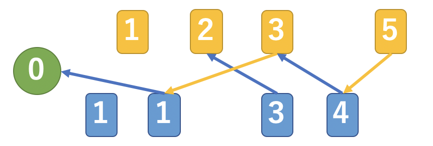

# CoqDaifugo
wonderful theory of Daifugo games

大富豪ゲームに関する理論を定理証明支援系Coqで証明しています。

Theorems about Daifugo games were proven with Coq, a reliable proof asistant.

## 二人単貧民の基本定理 The main theorem of Tanhinmin

単貧民は二人、一枚出し、特殊ルールなしの大富豪です。  
二人単貧民はゲーム木探索を用いずとも以下のように勝敗を計算できます。

- 先手手札　

- 後手手札　

- 場の強さ　 （0が空、1以上が場札の強さ）

- 手札  から最も弱い札一枚を除いた手札　  
手札  から最も弱い札一枚を除いた手札　

- 手札  から手札  へ、それぞれの札からより弱い札へ辺を引いた二部グラフの最大マッチング数を表す関数　

として先手必勝の必要十分条件は

<a href="https://www.codecogs.com/eqnedit.php?latex=\dpi{300}&space;\mu&space;(X,&space;\bar{X}_{-}&space;&plus;&space;\{r\})&space;>&space;\mu&space;(\bar{X},&space;X_{-})\text{.}" target="_blank">&space;\mu&space;(\bar{X},&space;X_{-})\text{.}" title="\mu (X, \bar{X}_{-} + \{r\}) > \mu (\bar{X}, X_{-})\text{.}" /></a>

### 例

よって **先手必勝**

## 命題一覧

### 数式に関する補題
- min_lt_l     ... min p q < p -> min p q = q
- max_lt_l     ... p < max p q -> max p q = q

### リストに関する補題
- min_in               ... 最小の値は必ずリスト内にある
- max_in               ... 最大の値は必ずリスト内にある
- min_le_max           ... 最小値 <= 最大値
- min_eq_max_one       ... 要素一つのとき最大値と最小値は同じ
- insert_in            ... insertした値は結果のリストに含まれている
- insert_length        ... insert後のリスト長
- remove_length        ... remove後のリスト長
- remove_length_in     ... 含まれている値のremove後のリスト長
- insert_split         ... 値をinsertすると元のリストを分割する2つのリストに挟まれる
- remove_split         ... 値をremoveする際値を挟んで元のリストを構成する2つのリストに分けられる
- nth_min_in           ... 第n最小値は必ずリスト内にある
- min_cons             ... 最小値は先頭とそれ以外の最小値の小さい方
- min_le_remove_min    ... 値をremoveすると最小値は元の最小値以上
- in_range_min_max     ... リストに含まれる値はリストの最小値〜最大値の範囲にある
- mingt_gt_if_max_gt   ... リストの最大値が閾値を越えれば、閾値を超える最小値も閾値を超えている
- mingt_in_if_gt       ... 閾値を超える最小値が閾値を超えていれば、リストに含まれる

### ソート済みリストに関する補題
- sorted_one                 ... 要素一つのリストはソート済み
- sorted_split_left          ... ソート済みリストは分割してもソート済み(前)
- sorted_split_right         ... ソート済みリストは分割してもソート済み(後)
- sorted_remove_middle_hd    ... ソート済みリストから間を抜いてもソート済み(先頭1つ)
- sorted_remove_middle       ... ソート済みリストから間を抜いてもソート済み
- sorted_all_le              ... ソート済みリスト内の任意の値の比較
- sorted_insert_cons         ... insertの挙動 先頭の値以下なら先頭に付けるのと同じ
- sorted_insert_sorted       ... insertの挙動 値を挿入してもソート済みが保たれる
- sorted_remove_sorted       ... removeの挙動 値を除いてもソート済みが保たれる
- sorted_inv                 ... ソート済みリストの構成の逆
- sorted_min_is_hd           ... ソート済みリストの先頭は最小値
- sorted_max_is_last         ... ソート済みリストの最後尾は最大値
- sorted_nth_min_is_nth      ... ソート済みリストのn番目は第n最小値
- sorted_remove_insert       ... ソート済みリストからremoveしてinsertすれば元のリストに戻る
- sorted_same_clip           ... ソート済みリストの先頭と最後尾が同じなら組み替え可能
- sorted_remove_inv          ... ソート済みリストからすでに見つけた値をremoveすれば見つけた値の両側を合わせたリストになる
- sorted_mingt_split         ... ソート済みリストで基準値より大きい最小の値があればリストを分割できる

### マッチング数
- mu_nil_0_l                    ... μ ([], l) = 0
- mu_nil_0_r                    ... μ (l, []) = 0
- mu_le_length1                 ... μ (l1, l2) <= |l1|
- mu_le_length2                 ... μ (l1, l2) <= |l2|
- mu_le_mu_cons2                ... μ (l1, l2) <= μ (l1, y::l2)
- mu_cons2_le_S_mu              ... μ (l1, y::l2) <= S (μ(l1, l2))
- mu_le_mu_cons1                ... μ (l1, l2) <= μ (x::l1, l2)
- mu_cons1_le_S_mu              ... μ (x::l1, l2) <= S (μ(l1, l2))
- mu_le_mu_ins1                 ... μ (l1++l3, l2) <= μ (l1++x::l3, l2)
- mu_le_mu_ins2                 ... μ (l1, l2++l3) <= μ (l1, l2++y::l3)
- mu_ins1_le_S_mu               ... μ (l1++x::l3, l2) <= S (μ (l1++l3, l2))
- mu_ins2_le_S_mu               ... μ (l1, l2++y::l3) <= S (μ (l1, l2++l3))
- mu_compare_hd1                ... 左側の先頭の値の比較
- mu_compare_hd2                ... 右側の先頭の値の比較
- mu_eq_change_too_low          ... 左の最弱以降の札は強くてもμに影響しない(一枚)
- mu_eq_change_too_low_list     ... 左の最弱以降の札は強くてもμに影響しない
- mu_squeeze_one                ... 任意の1組のペアの取り出し
- mu_ins_eq_S_mu_hd1            ... 任意の1組のペアの追加 (左先頭)
- mu_le_mu_ins_prod_hd2         ... 任意の1組のペアの追加下界 (右先頭)
- mu_le_mu_ins_prod             ... 任意の1組のペアの追加下界
- mu_nonp_ins_le_S_mu_hd1       ... 任意の1組のペアでない値の追加上界（左先頭）
- mu_nonp_ins_le_S_mu_hd2       ... 任意の1組のペアでない値の追加上界（右先頭）
- mu_nonp_ins_le_S_mu           ... 任意の1組のペアでない値の追加上界
- mu_ins_le_S_S_mu              ... 任意の1組の値の追加上界
- mu_ins_mingt_eq_S_mu_hd1_one  ... 出せる最小の組の追加（左先頭1つ）
- mu_ins_mingt_eq_S_mu_hd2_one  ... 出せる最小の組の追加（右先頭）
- mu_ins_mingt_eq_S_mu          ... 出せる最小の組の追加
- mu_remove_ge_right_eq_mu      ... 左の最大以上の札を右から抜いてもマッチング数が変化しない
- mu_remove_le_left_eq_mu       ... 右の最小以下の札を左から抜いてもマッチング数が変化しない
- mu_cons2_w_eq_S_mu_if_ne      ... フルマッチングでないとき、左最弱のさらに下の札が来ればマッチング数は1増える
- mu_fm_if_mu_swap21_eq_S_mu    ... 左交換によりマッチング数が減る場合は後方の全てがマッチしている
- mu_fm_if_SS_mu_remove21_eq_mu ... 左の二番目+右抜きによりマッチング数が2減る場合は全ての札がマッチしている
- mu_le_len2_if_mu_swap_eq_S_mu ... 右先頭の交換でマッチングが増えた場合のマッチング数の上限

### 手札
- forced_pass_cond           ... 最大の札が出せなければ出せる札がない
- unfold_removeminh          ... removeminhの展開を短縮
- ap_sorted_remove_ap_sorted ... removeの挙動 2枚以上なら値を除いてもAPソート済みが保たれる

### 手札マッチング数
- mu0_le_S_pred_nh1            ... μ0 <= S (pred |h1|) |h1| = 0 のときに注意
- mu0_le_pred_nh0              ... μ1 <= pred |h0| |h0| = 0 のときに注意
- puttable_mu0_gt_0            ... 出せる札がある -> μ0 > 0
- mu0_eq_0_not_puttable        ... μ0 = 0 -> 出せる札がない
- not_puttable_mu0_le_pred_nh1 ... 出せる札がない -> μ0 <= pred |h1|
- last_move_mu0_win            ... 一手勝ちなら μ0 = 1
- mu1_le_imu0                  ... 手札表現された μ (h0, h1) <= μ (h0 + {r}, h1)
- mu0_le_S_imu1                ... 手札表現された μ (h0 + {r}, h1) <=  S (μ (h0, h1))

### μ0 > μ1 のときの手の選び方
- win_move_pass_if_not_puttable     ... 出せる札がなければパス
- win_move_vmin_if_min_not_puttable ... 最小札が出せないならば出せる最小
- win_move_min_if_cond_ok           ... 最小でOKの条件を満たすならば最小
- win_move_second_if_cond_not_ok    ... 最小でOKの条件を満たさないならば二番目

### μ0 <= μ1 のときの手の評価
- lose_move_pass ... パスで勝てない
- lose_move_put  ... 出して勝てない

### 逆方向
- InductiveLoseNotWin     ... 次局面のすべてが「勝ち」かつ「負けでない」場合は「負け」かつ「勝ちでない」
- InductivePutWinNotLose  ... 札を出した次局面に「負け」かつ「勝ちでない」局面があれば「勝ち」かつ「負けでない」
- InductivePassWinNotLose ... パスをした次局面が「負け」かつ「勝ちでない」局面であれば「勝ち」かつ「負けでない」
- InductiveTermNotLose    ... 自手札が0枚であれば負けでない
- InductiveTermNotWin     ... 相手手札が0枚であれば勝ちでない

### 終端局面
- mu_win_term  ... 手札一枚で出せれば一手勝ち
- mu_lose_term ... 手札一枚ずつで出せずにパスで負け

### 帰納法ベースステップ
- mu_win_base      ... 手札一枚ずつで勝ちの場合
- mu_lose_base     ... 手札一枚ずつで負けの場合
- mu_win_lose_base ... base step まとめ

### 帰納法帰納ステップ
- mu_win_puttable_step     ... μ0 > μ1 で出せる札があれば勝ちの手がある
- mu_lose_step             ... μ0 <= μ1 ならばどの手でも負け
- mu_win_not_puttable_step ... μ0 > μ1 で出せる札がなければパスで勝ち
- mu_win_lose_step         ... induction step まとめ

### 手札枚数による帰納法
- sum_2_divide
- mu_win_lose_n
- mu_win_lose_all

### 結論
- mu_win_iff  ... 勝ち <-> μ0 > μ1
- mu_lose_iff ... 負け <-> μ0 <= μ1
